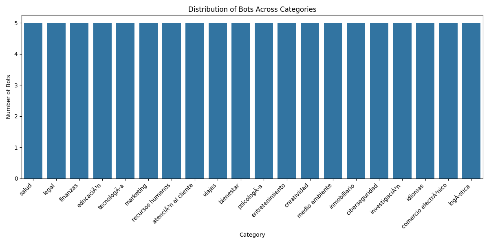
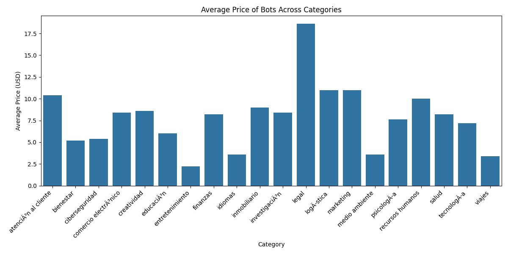

## Category Distribution\n\nThe following bar chart shows the distribution of bots across different categories:\n\n\n\ncategoria
salud                    5
legal                    5
finanzas                 5
educación               5
tecnología              5
marketing                5
recursos humanos         5
atención al cliente     5
viajes                   5
bienestar                5
psicología              5
entretenimiento          5
creatividad              5
medio ambiente           5
inmobiliario             5
ciberseguridad           5
investigación           5
idiomas                  5
comercio electrónico    5
logística               5\n\n## Average Price of Bots Across Categories\n\nThe following bar chart shows the average price of bots across different categories:\n\n\n\ncategoria
atención al cliente     10.4
bienestar                 5.2
ciberseguridad            5.4
comercio electrónico     8.4
creatividad               8.6
educación                6.0
entretenimiento           2.2
finanzas                  8.2
idiomas                   3.6
inmobiliario              9.0
investigación            8.4
legal                    18.6
logística               11.0
marketing                11.0
medio ambiente            3.6
psicología               7.6
recursos humanos         10.0
salud                     8.2
tecnología               7.2
viajes                    3.4\n\n## Category Distribution\n\nThe following bar chart shows the distribution of bots across different categories:\n\n\n\ncategoria
salud                    5
legal                    5
finanzas                 5
educación               5
tecnología              5
marketing                5
recursos humanos         5
atención al cliente     5
viajes                   5
bienestar                5
psicología              5
entretenimiento          5
creatividad              5
medio ambiente           5
inmobiliario             5
ciberseguridad           5
investigación           5
idiomas                  5
comercio electrónico    5
logística               5\n\n## Average Price of Bots Across Categories\n\nThe following bar chart shows the average price of bots across different categories:\n\n\n\ncategoria
atención al cliente     10.4
bienestar                 5.2
ciberseguridad            5.4
comercio electrónico     8.4
creatividad               8.6
educación                6.0
entretenimiento           2.2
finanzas                  8.2
idiomas                   3.6
inmobiliario              9.0
investigación            8.4
legal                    18.6
logística               11.0
marketing                11.0
medio ambiente            3.6
psicología               7.6
recursos humanos         10.0
salud                     8.2
tecnología               7.2
viajes                    3.4\n\n